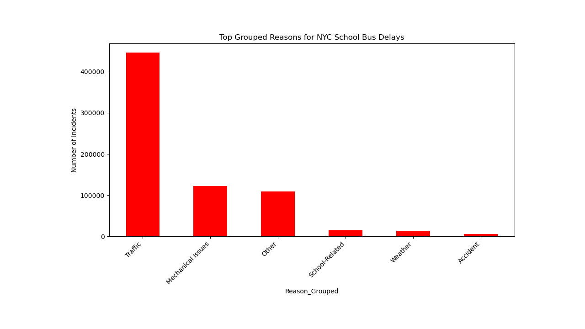
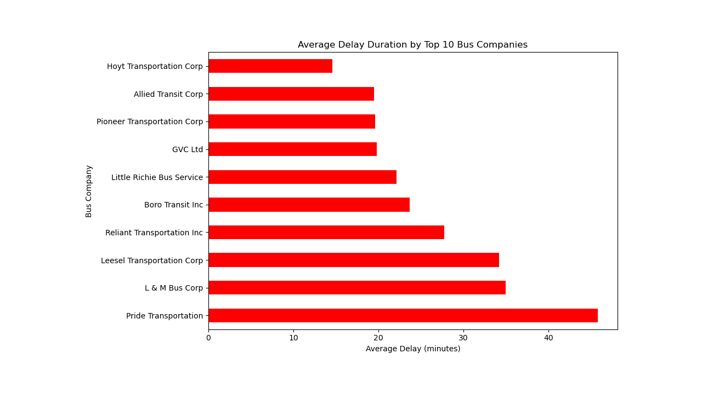
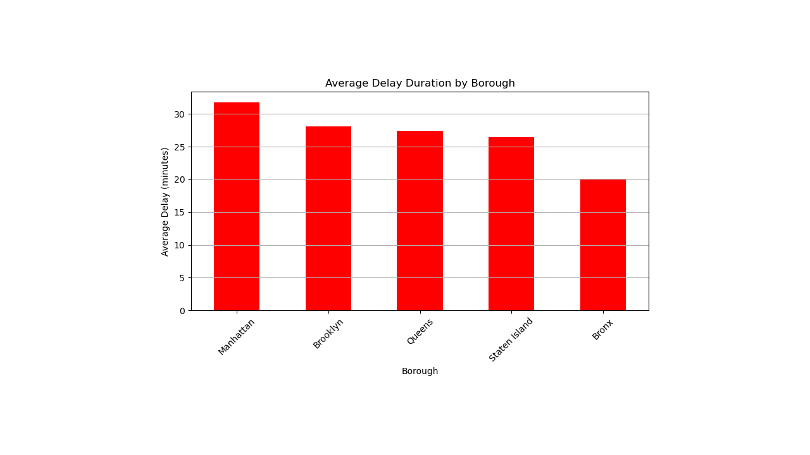
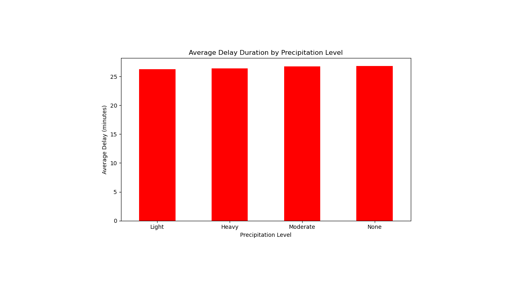
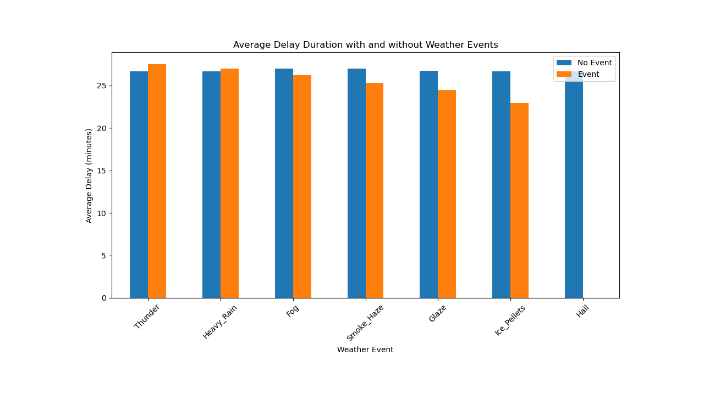
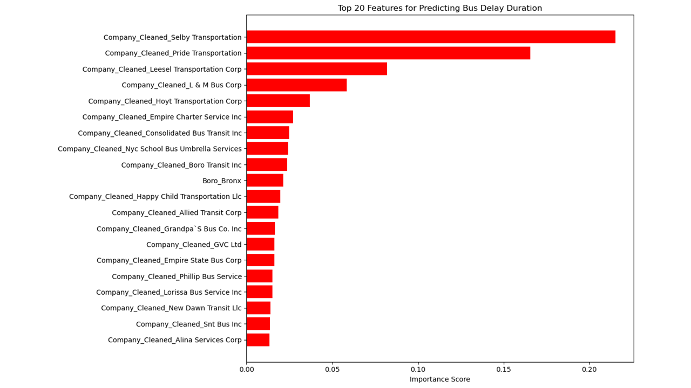

# NYC School Bus Delay Analysis and Prediction

This project explores the causes of school bus delays and breakdowns in New York City. I worked with historical data on bus operations from 2015 to 2024 and combined it with local weather data to find meaningful patterns and build a delay prediction model.

## Why I Chose This Project

I live in New York City, and my daughter takes the school bus every day. I've seen firsthand how delays can cause a ripple effect that impacts families, school routines, and student learning. That’s what made this project feel personal and important. I wanted to explore the patterns behind bus delays and see if it was possible to understand or even predict them using real data.

## What I Did

I started by cleaning and preparing the bus delay dataset. I standardized the date fields, grouped similar reasons for delay (such as combining mechanical issues), and removed incomplete or unclear values. Then, I merged this cleaned data with weather information from NOAA to explore how environmental factors might influence delays.

## What I Explored

Here are some of the key questions I investigated:
- What are the most common reasons for delays and breakdowns?
- Do certain boroughs or bus companies experience longer delays?
- How do weather events like thunderstorms affect delays?
- Are delays more common on specific days of the week?
- Can delay duration be predicted using early operational data?

## Tools and Techniques

-  Pandas and NumPy for working with and cleaning the data
-  Matplotlib and Seaborn for creating visualizations and comparing patterns
-  Random Forest and XGBoost models for prediction
-  Jupyter Notebook for organizing and documenting the entire process

## What I Found
To simplify and better reflect real-world operations, I grouped several related issues (like flat tires, won't start, and mechanical failure) into Mechanical Issues". I found Traffic and Mechanical issues accounted for a large portion of delays.
Some companies consistently had longer delays, with Pride Transportation topping the list. 
Manhattan showed longer average delays, which  tied to infrastructure or traffic congestion.

All four precipitation levels had very similar average delay times, between 26 and 27 minutes.
Weather events like thunder and heavy rain slightly increase delay durations, while others like hail had no measurable effect.
The model was able to predict delay duration with reasonable accuracy using operational and company-level features. This plot shows the most important features the model used to predict delay duration. The top two were bus company names.

## Final Thoughts

This project involved a lot of iteration, especially during the cleaning and merging stages. Figuring out how to group categories in a meaningful way was challenging. But the process helped me better understand how real data behaves and how to design questions that data can actually answer.

This was my final project for MSDS 692, and I aimed to make it demonstrate thoughtful work rather than just output. I hope it reflects the entire process from forming questions to drawing insights from them.
